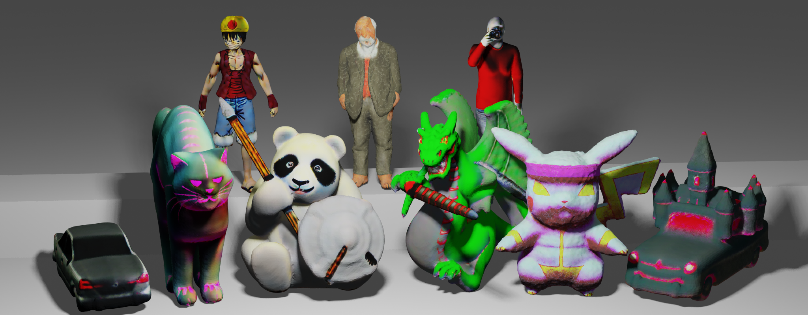

# Enhancing High-Resolution 3D Generation through Pixel-wise Gradient Clipping
### [[Paper]](https://arxiv.org/abs/2310.12474) | [[Project]](https://fudan-zvg.github.io/PGC-3D/)

> [**Enhancing High-Resolution 3D Generation through Pixel-wise Gradient Clipping**](https://arxiv.org/abs/2310.12474),            
> Zijie Pan, [Jiachen Lu](https://victorllu.github.io/), [Xiatian Zhu](https://surrey-uplab.github.io/), [Li Zhang](https://lzrobots.github.io)  
> **Arxiv preprint**

**Official implementation of "Enhancing High-Resolution 3D Generation through Pixel-wise Gradient Clipping".** 


**PGC** (Pixel-wise Gradient Clipping) introduces a refined method to adapt traditional gradient clipping. By focusing on pixel-wise gradient magnitudes, it retains vital texture details. This approach acts as a versatile **plug-in**, seamlessly complementing existing **SDS and LDM-based 3D generative models**. The result is a marked improvement in high-resolution 3D texture synthesis.

With PGC, users can:
- Address and mitigate gradient-related challenges common in LDM, elevating the quality of 3D generation.
- Employ the [**SDXL**](https://github.com/Stability-AI/generative-models) approach, previously not adaptable for 3D generation.

This repo also offers an unified implementation for mesh optimization and reproduction of many SDS variants.

# Install

```bash
git clone https://github.com/fudan-zvg/PGC-3D.git
cd PGC-3D
```

**Huggingface token**:
Some new models need access token.
Create a file called `TOKEN` under this directory (i.e., `PGC-3D/TOKEN`) 
and copy your [token](https://huggingface.co/settings/tokens) into it.

### Install pytorch3d

We use pytorch3d implementation for normal consistency loss, so we need first install pytorch3d.
```bash
conda create -n pgc python=3.9
conda activate pgc
conda install pytorch=1.13.0 torchvision pytorch-cuda=11.6 -c pytorch -c nvidia
conda install -c fvcore -c iopath -c conda-forge fvcore iopath
conda install pytorch3d -c pytorch3d
```

### Install with pip and build extension

```bash
pip install -r requirements.txt
bash scripts/install_ext.sh
```

### Tested environments
* Ubuntu 20 with torch 1.13 & CUDA 11.7 on two A6000.

# Usage

This repo supports mesh optimization (Stage2 of Magic3D/Fantasia3D) with many methods including SDS, VSD, BGT, CSD, SSD loss and PBR material modeling.
If you find error/bug in the reproduction, feel free to raise an issue.
We assume a triangle mesh is provided.

```bash
### basic options
# -O0             pixel-wise gradient clipping
# -O1             Stage2 of Magic3D/Fantasia3D using DMTet
# -O2             with mesh fixed
# -O3             using an image as reference and Zero123 (not fully tested)
# -O4             using SDXL
# --pbr           PBR modeling as nvdiffrec/Fantasia3D
# --vsd           VSD loss proposed by ProlificDreamer (only implemented for SDXL, so -O4 is needed)
# --bgt           BGT+ loss proposed by HiFA
# --csd           Classifier Score Distillation
# --ssd           Stable Score Distillation
# --dreamtime     an annealing time schedule proposed by DreamTime
# --latent        training in latent space as Latent-NeRF
# --cfg_rescale   suggested by AvatarStudio
# --init_texture  initialize texture if mesh has vertex color
# --bs 4          batch size 4 per gpu

### sample commands
# all the time is tested on two A6000 
# text-to-texture using SDXL with depth controlnet (46G, 36min)
python main.py -O0 -O2 -O4 --guidance "controlnet" --text "A panda is dressed in armor, holding a spear in one hand and a shield in the other, realistic" --workspace panda/sdxl --gpus "0,1" --mesh_path "data/panda_spear_shield.obj"

# PBR modeling (48G, 36min)
python main.py -O0 -O2 -O4 --pbr --guidance "controlnet" --text "A panda is dressed in armor, holding a spear in one hand and a shield in the other, realistic" --workspace panda/pbr --gpus "0,1" --mesh_path "data/panda_spear_shield.obj"

# VSD loss (42G, 60min)
python main.py -O0 -O2 -O4 --vsd --guidance_scale 7.5 --text "A panda is dressed in armor, holding a spear in one hand and a shield in the other, realistic" --workspace panda/vsd --gpus "0,1" --mesh_path "data/panda_spear_shield.obj"

# optimize the shape using normal-SDS as Fantasia3D (46G, 33min)
python main.py -O0 -O4 --only_normal --text "A panda is dressed in armor, holding a spear in one hand and a shield in the other, realistic" --workspace panda/normal_sds --gpus "0,1" --mesh_path "data/panda_spear_shield.obj"
# if finetune, add depth control to stablize the shape (46G, 36min)
python main.py -O0 -O4 --only_normal --guidance "controlnet" --text "A panda is dressed in armor, holding a spear in one hand and a shield in the other, realistic" --workspace panda/normal_sds --gpus "0,1" --mesh_path "data/panda_spear_shield.obj"

# optimize both shape and texture using RGB-SDS as Magic3D (46G, 36min)
python main.py -O0 -O4 --no_normal --guidance "controlnet" --text "A panda is dressed in armor, holding a spear in one hand and a shield in the other, realistic" --workspace panda/rgb_sds --gpus "0,1" --mesh_path "data/panda_spear_shield.obj"

# optimize both shape and texture using both normal-SDS and RGB-SDS (47G, 74min)
python main.py -O0 -O4 --guidance "controlnet" --text "A panda is dressed in armor, holding a spear in one hand and a shield in the other, realistic" --workspace panda/nrm_rgb_sds --gpus "0,1" --mesh_path "data/panda_spear_shield.obj"

# We also support multi-controlnets, e.g. depth + shuffle control with a reference image (only Stable Diffusion v1.5)
# 20G, 22min
python main.py -O0 -O2 --ref_path "data/panda_reference.png" --control_type "depth" "shuffle" --control_scale 0.7 0.3 --text "A panda is dressed in armor, holding a spear in one hand and a shield in the other, realistic" --workspace panda/sd_depth_shuffle --gpus "0,1" --mesh_path "data/panda_spear_shield.obj"
```

## Results
Incorporating the proficient and potent **PGC** implementation into SDXL guidance has led to notable advancements in 3D generation results.

#### [Fantasia3D](https://github.com/Gorilla-Lab-SCUT/Fantasia3D)


#### Ours


https://github.com/fudan-zvg/PGC-3D/assets/84657631/a04cd157-6666-4fd3-b3a1-069f4ec8f255

## Tips for SDXL
- Using [sdxl-vae-fp16-fix](https://huggingface.co/madebyollin/sdxl-vae-fp16-fix)
- [Controlnet](https://huggingface.co/diffusers/controlnet-depth-sdxl-1.0) may be important to make training easier to converge

## BibTeX
If you find our repository useful, please consider giving it a star ⭐ and citing our paper in your work:
```
@article{pan2023enhancing,
  title={Enhancing High-Resolution 3D Generation through Pixel-wise Gradient Clipping},
  author={Pan, Zijie and Lu, Jiachen and Zhu, Xiatian and Zhang, Li},
  journal={arXiv preprint arXiv 2310.12474},
  year={2023}
}
```
